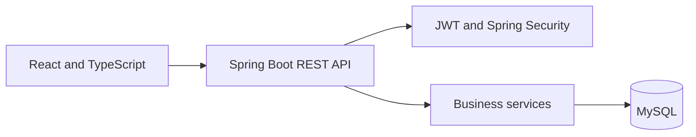
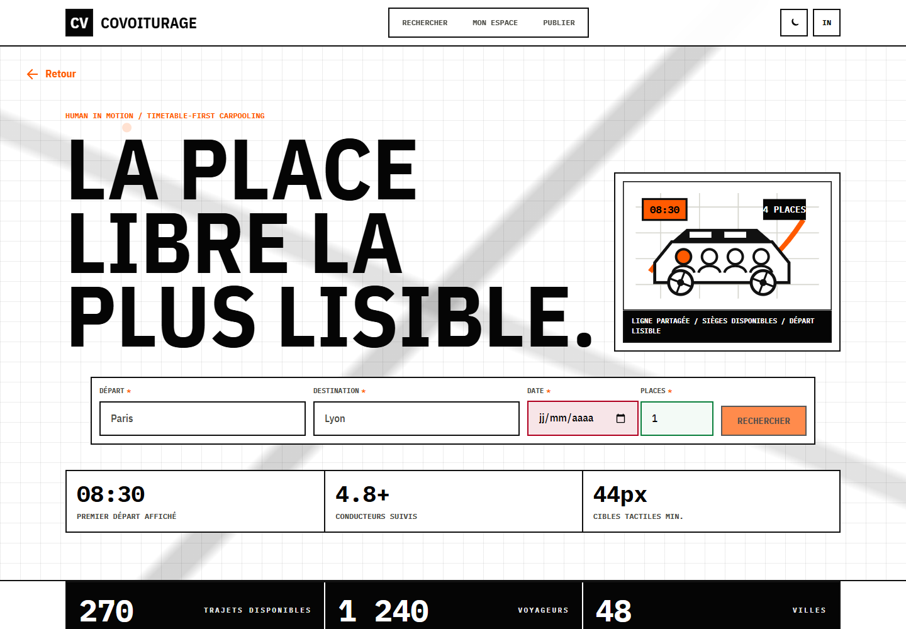
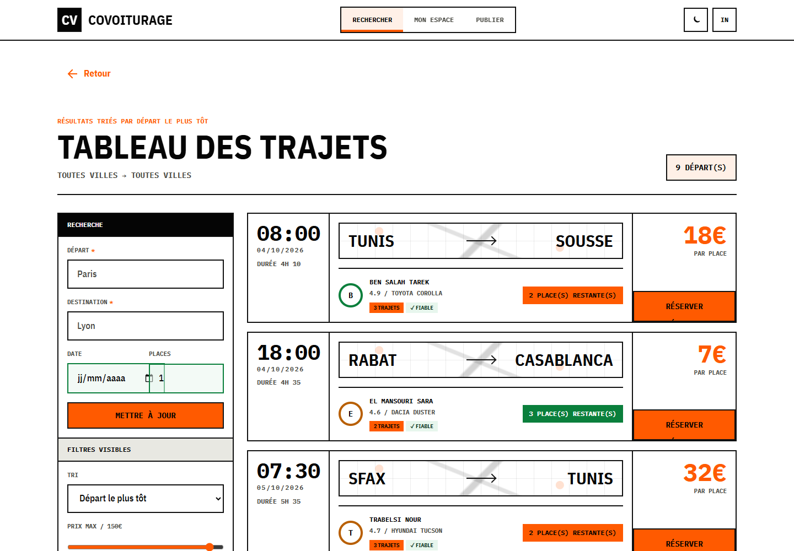
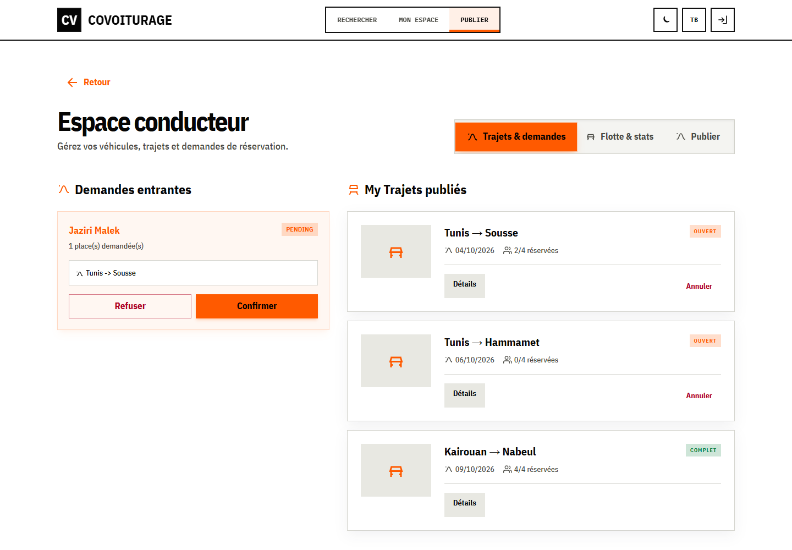
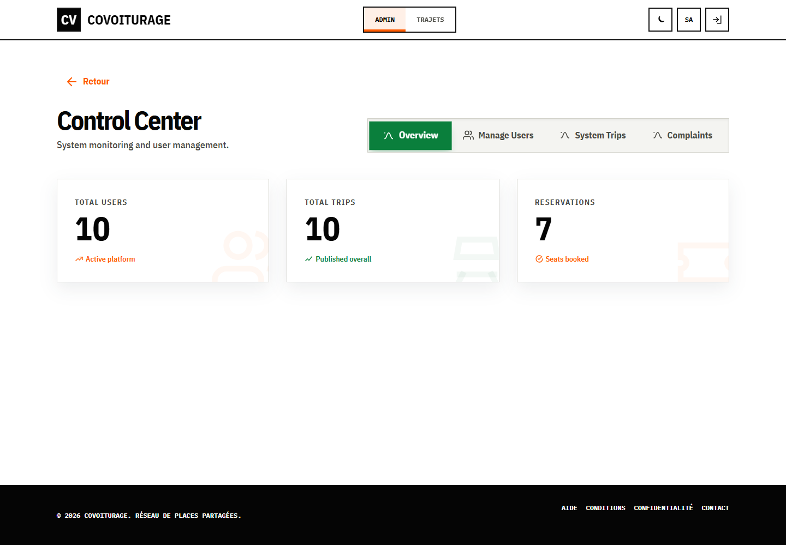

# Carpooling Platform

[](https://github.com/KhaledZouari/carpooling-platform/actions/workflows/ci.yml)
[](LICENSE)

A full-stack carpooling application supporting passenger, driver, and
administrator workflows through a secured REST API.

## Features

- JWT authentication and role-based access control
- Driver vehicle and ride management
- Passenger ride search, booking, and cancellation
- Driver approval or rejection of booking requests
- Administrative user and platform oversight
- Responsive interface with light and dark themes

## Stack

React, TypeScript, Vite, Spring Boot, Spring Security, MySQL, Vitest, and GitHub
Actions.

## Architecture



The frontend separates pages, reusable components, API clients, and application
context. The backend separates controllers, DTOs, services, repositories,
security, and persistence.

## Local setup

This repository contains the React frontend. The Spring Boot backend lives in
[cov-backend](https://github.com/KhaledZouari/cov-backend). Configure
`VITE_API_BASE_URL` using `.env.example`, and keep backend secrets outside Git.

```bash
# Frontend
npm ci
npm run dev

# Backend (separate repository)
git clone https://github.com/KhaledZouari/cov-backend.git
cd cov-backend
./mvnw spring-boot:run
```

## Verification

```bash
npm run lint
npm test
npm run build
./mvnw verify
```

CI installs dependencies reproducibly, runs lint and tests, and builds the
application on pushes and pull requests.

## Business context and engineering approach

### Role-based shared mobility

Passengers search for departures and request seats; drivers publish trips and
review bookings; administrators supervise the platform. The React application
uses the separately maintained Spring Boot API rather than implementing booking
rules in the browser.

DTOs define API contracts, Spring services enforce workflow rules and Spring
Security authenticates JWTs. Separate dashboards keep each role focused on its
own tasks.

## Application screenshots

Captured from the running application on 3 October 2026.

### Trip discovery



Entry point for departure, destination, date and available seats.

### Search results



Departure cards, seat availability and visible search filters.

### Driver workspace



Published trips and booking-management workspace.

### Administration



Role-specific platform supervision using seeded demo accounts.

## Evidence and current scope

The seeded accounts and journeys are fictional. Landing-page counters are
illustrative UI content; they do not represent active users or operating-
platform statistics.

## License

Distributed under the MIT License. See [LICENSE](LICENSE).
