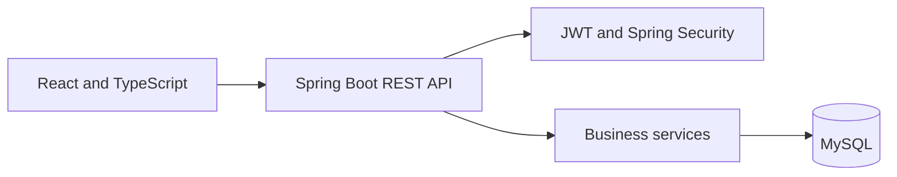

# Carpooling Platform

[](https://github.com/KhaledZouari/carpooling-platform/actions/workflows/ci.yml)
[](LICENSE)

A full-stack carpooling application supporting passenger, driver, and
administrator workflows through a secured REST API.

## Features

- JWT authentication and role-based access control
- Driver vehicle and ride management
- Passenger ride search, booking, and cancellation
- Driver approval or rejection of booking requests
- Administrative user and platform oversight
- Responsive interface with light and dark themes

## Stack

React, TypeScript, Vite, Spring Boot, Spring Security, MySQL, Vitest, and
GitHub Actions.

## Architecture



The frontend separates pages, reusable components, API clients, and application
context. The backend separates controllers, DTOs, services, repositories,
security, and persistence.

## Local setup

Follow the environment templates in the frontend and backend directories.
Keep database credentials and JWT secrets outside version control.

```bash
# Frontend
npm ci
npm run dev

# Backend
./mvnw spring-boot:run
```

## Verification

```bash
npm run lint
npm test
npm run build
./mvnw verify
```

CI installs dependencies reproducibly, runs lint and tests, and builds the
application on pushes and pull requests.

## License

Distributed under the MIT License. See [LICENSE](LICENSE).

