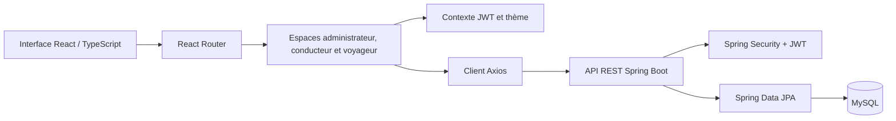
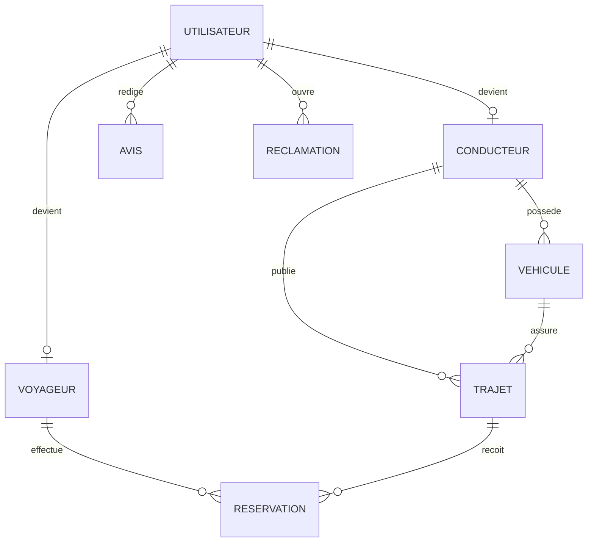

# Covoiturage — frontend

Interface web d’une plateforme de covoiturage reliant voyageurs, conducteurs
et administrateurs à une API Spring Boot dédiée.

## Fonctionnalités

- Recherche et consultation de trajets.
- Inscription, connexion et mise à jour du profil utilisateur.
- Réservation, confirmation, refus et annulation de places.
- Gestion des trajets et véhicules côté conducteur.
- Avis, réclamations et espace d’administration.

## Stack

React 19, TypeScript, Vite, React Router, Axios, Tailwind CSS, GSAP, ESLint et
Vitest.

## Architecture



Les contrats TypeScript sont regroupés dans `src/types`, les appels réseau
dans `src/api`, l’état transversal dans `src/context` et les interfaces par
rôle dans `src/pages`.

## Installation

Prérequis : Node.js 20 et npm.

```bash
git clone https://github.com/KhaledZouari/carpooling-platform.git
cd carpooling-platform
cp .env.example .env
npm ci
npm run dev
```

Sous PowerShell, utiliser `Copy-Item .env.example .env` à la place de `cp`.
L’application de développement est servie sur `http://localhost:5173`.

## Configuration

| Variable | Description | Valeur locale |
|---|---|---|
| `VITE_API_BASE_URL` | URL de base de l’API. | `http://localhost:8089/api` |

Le fichier `.env.example` documente la configuration sans contenir de secret.

## Tests et qualité

```bash
npm run lint
npm test
npm run build
```

La CI exécute l’installation reproductible, ESLint, les tests Vitest et le
build de production sur chaque pull request et chaque push sur `main`.

## API

Le client couvre les ressources principales suivantes, vérifiées dans les
contrôleurs Spring Boot :

| Ressource | Endpoints principaux |
| --- | --- |
| Authentification | `POST /api/auth/register`, `POST /api/auth/login`, `GET /api/auth/me` |
| Trajets | `GET/POST /api/trajets`, `GET/PUT/DELETE /api/trajets/{id}` |
| Réservations | `POST /api/reservations`, `GET /api/reservations/mes-reservations`, actions confirmer/refuser/annuler |
| Véhicules | `POST /api/vehicules`, `GET /api/vehicules/mes-vehicules`, suppression et ajout d’image |
| Avis et réclamations | `POST /api/avis`, `POST /api/reclamations`, consultation de ses réclamations |
| Administration | utilisateurs, trajets, réclamations et statistiques sous `/api/admin` |

Le backend Spring Boot est privé sur demande ; son code peut être présenté en
entretien. Il utilise Spring Security, JWT, Spring Data JPA et MySQL, avec les
trois rôles `ADMIN`, `CONDUCTEUR` et `VOYAGEUR`.

## Modèle de données simplifié



## Captures d’écran

Les futures captures sont regroupées dans `docs/screenshots/`.

## Choix techniques

- Axios centralise l’URL de base et la transmission du jeton d’accès.
- Les types partagés sécurisent les contrats entre les pages et l’API.
- Les thèmes par rôle différencient les espaces public, voyageur, conducteur
  et administrateur.

## Pistes d’amélioration

- Remplacer l’URL absolue des images de véhicules par une variable dédiée.
- Découper le bundle principal avec des imports dynamiques par page.
- Étendre les tests aux parcours d’authentification et de réservation.

## Licence

Ce projet est distribué sous licence MIT. Voir [LICENSE](LICENSE).
